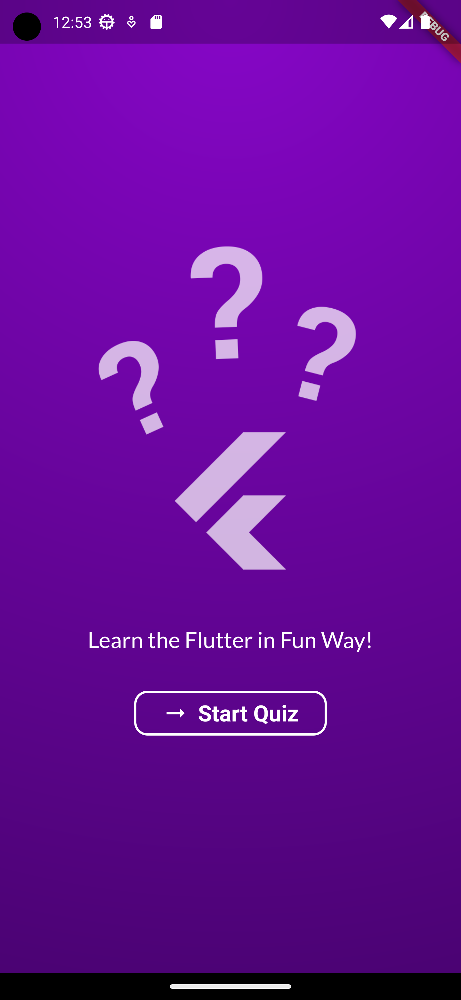
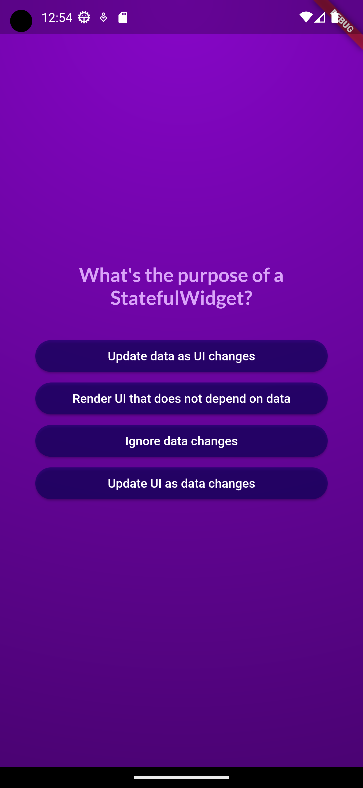
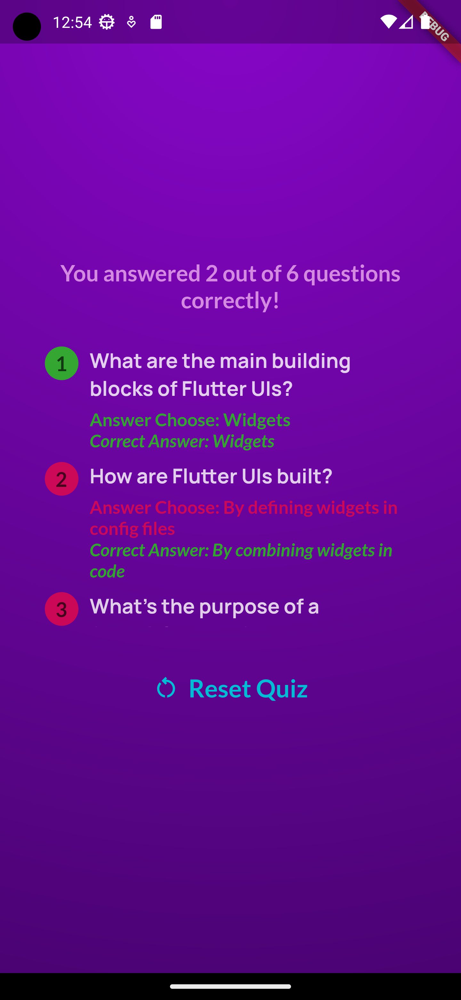

# Quiz App

Quiz App is a Flutter-based mobile application that allows users to take quizzes on flutter framework with dart. It utilizes Google Fonts for a beautiful typography experience and includes images to enhance the user interface.

## Features

- Multiple-choice quiz questions.
- Score tracking.
- Google Fonts for elegant typography.
- Images for a visually appealing UI.

## Getting Started

These instructions will help you get a copy of the project up and running on your local machine for development and testing purposes.

### Prerequisites

Before you begin, ensure you have met the following requirements:

- Flutter SDK: [Installation Guide](https://flutter.dev/docs/get-started/install)
- Dart SDK: [Installation Guide](https://dart.dev/get-dart)
- Google fonts: [Installation Guide](https://pub.dev/packages/google_fonts)
- Android Studio / Xcode: For Android/iOS development.

### Installation

1. Clone the repository:

   ```bash
   git clone https://github.com/your-username/quiz-app.git
   ```

2. Change your current directory to the project folder:

   ```bash
   cd quiz-app
   ```

3. Install the Dependencies:
   ```bash
   flutter pub get
   ```

## Usage

- Run the application:
- Open the app on your emulator or physical device.
- Start taking quizzes and enjoy!

## Screenshot





## Contribution

Contributions are welcome! If you would like to contribute to the project, please follow these steps:

- Fork the repository.
- Create a new branch for your feature or bug fix.
- Make your changes and test them thoroughly.
- Submit a pull request with a clear description of your changes.

## Acknowledgements

- Thanks to the Flutter and Dart communities for their great work and contributions.
- Special thanks to [Google Fonts](https://fonts.google.com) for providing free, high-quality fonts for the project.
